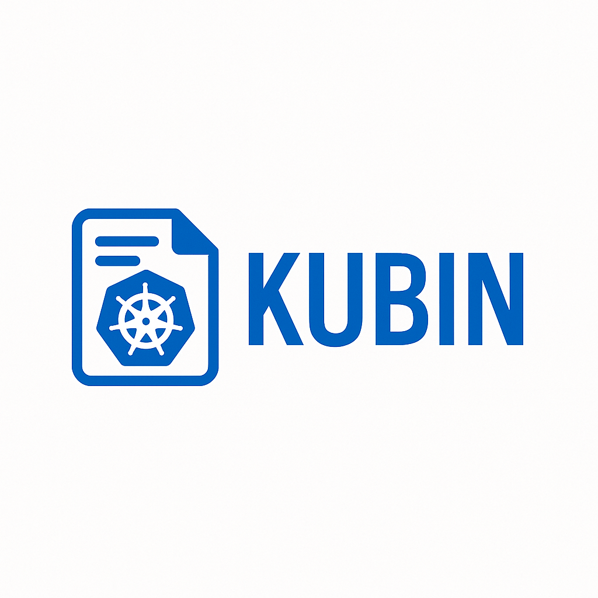

# Kubin (WIP)



**Pastebin for Kubernetes clusters**

Capture your cluster state with one command, get a shareable link, and explore it in a Lens-like interface.

## Quick Start

```bash
# Install CLI
go install github.com/3nd3r1/kubin/cli@latest

# Capture cluster and get shareable link
kubin create

# Share the link with your team
# They can view the cluster state in their browser
```

## What it does

Instead of sharing cluster dumps as files in Jira tickets:

1. Run `kubin create`
2. Get an immediate shareable URL
3. Anyone can explore the cluster state in a familiar Kubernetes dashboard
4. Search and analyze logs with sub-second query performance

## Architecture

Kubin uses a modern microservices architecture optimized for high-throughput uploads and sub-second queries:

### Components

**CLI Tool** (`/cli`)

- Command-line tool for capturing cluster snapshots
- Connects to Kubernetes clusters and uploads data
- Distributed as a binary like `kubectl` or `docker`

**Microservices Platform** (`/services`)

- **API Gateway**: Single entry point with auth, rate limiting, and routing
- **Upload Orchestrator**: Coordinates multi-step upload workflow with immediate URL generation
- **Metadata Service**: Fast PostgreSQL storage for K8s resource metadata and search
- **Storage Service**: Manages S3 file operations and generates pre-signed URLs
- **Log Processor**: Background parsing of logs into structured ClickHouse data
- **Query Service**: Orchestrates data from multiple services with Redis caching
- **Analytics Service**: Advanced log search and time-series analysis

**Web UI** (`/ui`)

- React-based interface for exploring snapshots
- Lens-like experience with powerful search capabilities
- Real-time log analytics and visualization

More info at: [docs/architecture.md](docs/architecture.md)

## Use Cases

- **Debugging**: Capture cluster state when troubleshooting issues with team collaboration
- **Documentation**: Save cluster configurations for reference and compliance
- **Sharing**: Share cluster states with team members or support without file transfers
- **Backup**: Quick backup of cluster configurations with versioning
- **Audit**: Track changes in cluster state over time with analytics
- **Log Analysis**: Query and analyze historical log data with powerful search
- **Instant Sharing**: Get shareable URLs in under 2 seconds

## Development

TODO

More info at: [docs/development.md](docs/development.md)

## License

MIT
